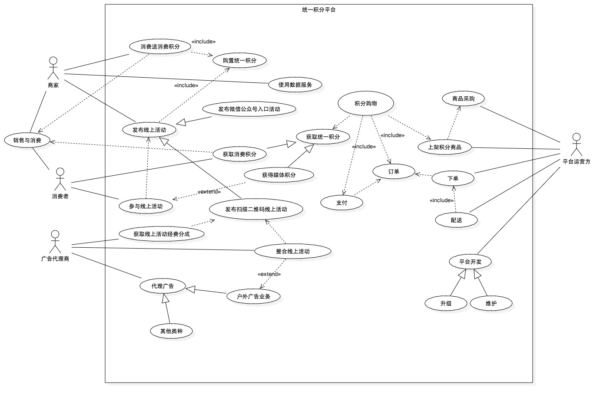

#统一积分平台商业计划书#

##一、公司概况##

启动此项目，需要成立一个独立的互联网公司，专项运营。目前拟定为注册资本50万的互联网平台运行公司。

> 公司抬头：英文名 ``UniteCredit`` 中文名 ``优特``

> 公司宗旨：创造媒体积分，统一消费积分，合并两者。

> 公司文化：scrum敏捷文化

> 公司使命：

>  1. 让消费者获得更实在的消费回馈，积极参与商业活动
>  2. 让商家高效利用广告支出、获取商业决策性数据分析
>  3. 让广告代理商获得线上线下广告一体化服务

> 公司愿景：打造中国第一个统一全领域、全行业积分一体化服务平台。

##二、项目构思初衷##

###现状描述###

> 需要描述的对象主要分为两大块，

####1）商家销售活动###

> 许多商家为了增加其消费者的消费黏度，都采用了由自己运作和维护的积分系统。

如中国电信，在进行一系列手机销售、话费充值的商业活动中都采用了消费赠送积分策略。消费者所累积的积分可以前往中国电信
线上的积分商城进行商品兑换。

如滴滴出行，消费者通过滴滴出行提供的打车服务，会给予一定的积分。消费者所累积的积分可以前往滴滴出行线上积分商城兑换物品。

如银行，几乎所有银行都有自己的积分系统，除了消费增积分，而且还制定了一些指定商家消费的优惠活动。

> 其优点是：

 1. 自我可控性高，可以为自己的消费客户提供特色服务。
 2. 在增加消费者黏度基础上，还能为其附属商品进行二次广告或者为第三方企业提供广告业务。
 3. 运营得当，可以建立向第三方企业提供广告代理业务从而获取收益的一种商业模式。

> 但其缺点也显而易见：

 1. 运营和维护一个完善的积分系统，费用支出非常高，往往是亏损的。
 2. 支持线上积分商城的商家，需要建立独立的部门，负责线上线下的双重运行，管理难度大大提升。
 3. 商家提供积分兑换物品往往是一些淘汰货、廉价物，对于消费者的诱惑力一般。
 4. 作为消费者，获取积分的渠道很多，但是这些积分都是分散的，分散导致消费者对积分的关注力也分散，最后结果可能是一个都不关注。
 
> 消费者是客户，所谓客户是上帝，商家的行为往往是需要满足消费者的意向性。但由于商家之间要么各自不相干，要么是竞争对手，商家
之间没有达成统一积分的意向，这也是为什么需要一个第三方机构统一所有商家积分系统的原因。

####2）商家推广活动####

> 商家为了销售，推广活动是一种刚需。组织线上线下活动，投放线下线上广告。

如商家发布新产品的时候，会在某个商业广场策划一个新产品优惠促销活动。在活动过程中，向消费者发放小礼品、进行抽奖活动、赠送优惠券等等，
从而吸引参与者的注意力。

如商家投放在户外广告牌上的广告内容，也基本采用关注送礼品、分享送礼品、到场送礼品、消费给优惠等等的推广营销策略。

> 其特点是：

 1. 向参与活动的人赠送礼品，拉拢人气，提升活动气氛，从而拉拢更多人的参与，以便向更多人传达活动内容信息。
 2. 活动中赠送物品，大多是一些廉价小物品，或者采用抽奖方式赠送小数目的高价物品，无论怎样，商家都会在赠送物品上需要额外支出。
 3. 广告牌上的活动内容，
 
 
> 总结其缺点是：

 1. 如果是实物，在活动现场发放比较直接，但参与者不在现场，要么送货上门，要么通知现场领取，这个环节一般不可取。
 2. 商家需要考虑赠送什么样的礼品，并且进行采购，尤其采购环节非常琐碎。
 3. 活动周围的流动人群中，大多数对于这种小恩小惠的诱惑方式不感兴趣。
 
> 既然商家在赠送礼品这个环节需要额外支出，那么是否考虑一种新型的赠送礼品呢？对，积分，参与者领取非常方便，拿出手机扫一下就可以完成；
统一积分，参与者参与任何的活动如果拿到的是统一积分，可以累加，如同领取的是微信红包，因为用它可以购物。

###解决方案###

####核心问题####

> 1. 消费者获取积分类种仅消费积分一种。
> 2. 消费者获取积分来源分散，积分无法统一。
> 3. 商家运行积分系统费用支出非常高，但目的成效低。
> 4. 中小商家无能力支撑线上积分商城的开发。
> 5. 线上积分商城开发、维护和升级，不仅需要维持成本，还需要高效的开发团队，这一点非常难。

  
####核心目标####

> 1. 创造新型的积分类种：媒体积分
> 2. 统一积分来源，商家从统一积分平台购置积分，然后向消费者发放。
> 3. 提供统一积分商城，让消费者可以积分购物。
> 4. 降级商家积分系统的维护与管理成本，甚至撤销商家积分系统。
> 5. 为商家提供一体化统一积分平台服务，如制定消费积分策略，活动参与积分策略等等。
> 6. 提供专业开发团队，根据用户需求反馈以及数据分析，开发更加实用、有效的特性功能。
> 7. 进行大数据挖掘，为商家提供决策性数据。

####核心运行流程####

####平台实施需求####

##三、平台介绍##

统一积分平台，针对三类用户提供服务。

