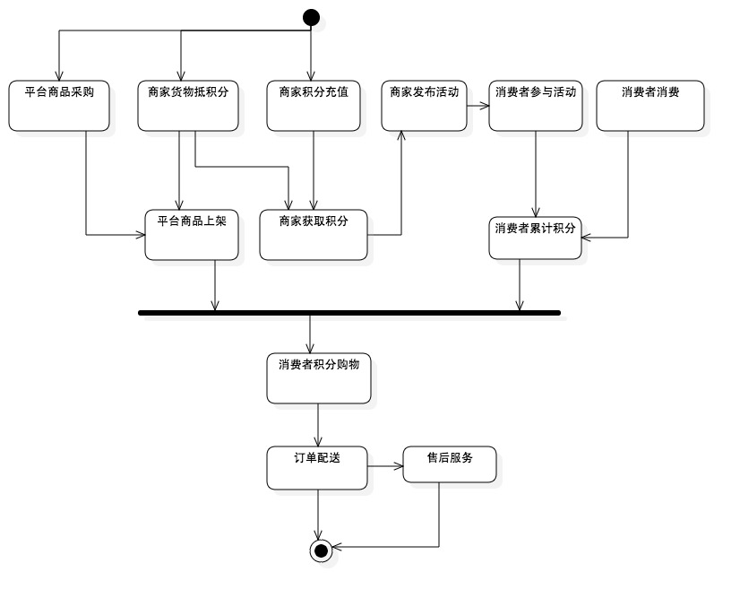

#统一积分平台商业计划书#

##1、公司概况##

启动此项目，需要成立一个独立的互联网公司，专项运营。目前拟定为注册资本500万的互联网平台运行公司。

> 公司抬头：``横扫天下``

> 公司宗旨：创造媒体积分，统一消费积分，合并两者。

> 公司文化：scrum敏捷文化

> 公司使命：

>  1. 让消费者获得更实在的消费回馈，积极参与商业活动
>  2. 让商家高效利用广告支出、获取商业决策性数据分析
>  3. 让广告代理商获得线上线下广告一体化服务

> 公司愿景：打造中国第一个统一全领域、全行业积分一体化服务平台。

##2、项目内容阐述方式##

> 1. 目标 - 要做什么？
> 2. 理由 - 为什么要这么做？
> 3. 收益 - 做了有什么好处？ 
> 4. 依据 - 能不能做？
> 5. 资本 - 有能力做么？
> 6. 方法 - 该如何做？
> 7. 前提 - 做之前需要什么？
> 8. 风险 - 做的难点在哪里？
> 9. 前景 - 能做多大？

##3、目标##

> 创造媒体积分，统一消费积分，合并两者。

商家在媒体推广活动所支出的部分费用会赠予消费者，以激励消费者参与活动的积极性。
目前这部分费用大多数商家采用实物、折扣方式相赠，我们的目标是让商家采用我们平台提供的统一积分（媒体积分）。

消费者在商家处消费后，根据商家的积分策略给予一定的积分馈赠。
我们的目标是让商家采用我们平台提供的统一积分（消费积分）。

> 分``媒体积分``与``消费积分``两大类，主要是为了区分其来源的性质不同，实质一样，统称``平台统一积分``。

以下是实现目标的基本运行流程:

> 如图，完成统一积分销售，发放，领取，消费整体流程。

##4、理由##

> 整个平台的运营环节中，存在四个主体角色，站在不同角色角度，分析其利弊关系。

> 1. 消费者 － 商家的客户，商家营销推广的对象
> 2. 商家 － 产品的生产商、经销商，服务的提供商
> 3. 广告代理商 - 广告投放、广告策划，活动策略公司
> 4. 运行商 － 统一积分平台运行公司

###4.1、创造媒体积分###

> 媒体积分 － 参与商家商业活动的过程中，商家发放给参与者的激励介质，目的为了刺激参与者参与积极性。

####4.1.1、现状####

下面列举几个经典的场景加以描述：

**商业广场活动**

通常商业活动举办方，一般会在现场组织一些表演类活动内容，唱歌、舞蹈等等，来活动现场气氛，拉拢周围人群。
除此之外，基本都会在活动过程中，向参与者发放馈赠物品来进一步提高现场参与积极性。
馈赠物品一般都为价格低廉的小物件，或是折扣券、抵扣券等等。如果赠送价格昂贵的物品，一般会采用现场抽奖方式，数量极其有限。

以上存在的问题是什么？

 1. 作为商家，制定奖品内容和采购奖品都需要额外付出精力和开销。
 2. 作为商家，人群涌动的现场，发放物品可能不便。
 3. 作为商家，当天活动的奖励物品可能会剩余，后续处理比较繁琐。或者当天所赠物品不够，也会产生尴尬局面。
 4. 作为商家，如果需要统计现场参与数量与参与者具体情况，添表格方式基本不切实际。
 5. 作为消费者，对于司空见惯的此类商业活动，参与的积极性不高，潜意识认为不会有什么受益。对于赠送物品也是可有可无的心态。
 6. 作为消费者，由于害羞，尴尬的原因，基本会放弃上台参与活动，如有奖问答，团体小游戏等等。
 
**宴席婚礼现场**

中国人办喜酒主题就是为了个一个喜庆，为了获得这种现场气氛，现在基本都让婚庆公司一手包办。
活动内容一般也是娱乐性质的为主体，唱歌、跳舞、魔术、才艺表演等等。不过发红包是必备的一项活动，
有现场撒红包，有才艺表演给红包，还有奖问答给红包多种形式。

以上存在的问题是什么？

 1. 作为婚礼主办方，包红包，大大小小，都得事前准备。
 2. 作为婚礼主办方，红包发放往往由婚庆公司司仪经手，私藏腰包也是没有可能，统计发放的红包金额也比较繁琐。
 3. 作为婚庆公司，尤其在酒桌数量庞大的现场，发放红包顾及面狭窄，领取红包也是极为不便。
 4. 作为婚庆公司，如果在现场要宣传其自身业务内容，基本不可能。
 
当然红包，采用纸张方式包裹，是一种习俗和传统，作为新兴一代人，打破传统，接受新事物不是不可能，只要活动玩法足够吸引力，足够有实效。

**牌位广告活动**

广告业牌位广告还是占主体，这种传统广告方式对于区域化本地化商家来说，还是最佳选择之一。广告主要的内容类种，一般归纳为以下几种类型：

 1. 品牌宣传 － 产品品牌，企业品牌。
 2. 新产品发布前推广 － 如电影，演唱会等等。 
 3. 新产品上市 － 强大产品新特性、新功能。
 4. 节日活动促销
 5. 季节性促销活动
 6. 服务、品牌、公司认知度推广
 
牌位广告所能覆盖范围很广，商业楼，广场，公交车，地铁，火车，飞机，楼道，电梯等等。这种形式广告特征是：

 1. 定位性推广
 2. 消费者潜意识认知商家的可信度
 3. 本地化，区域化效果好
 
由于互联网的介入，对比存在以下的问题：

 1. 作为广告代理商和商家，无法统计广告内容被浏览的次数和人数，这一点只能通过来往人流量估算，但这个很不精确。
 2. 作为商家，期限内广告内容固定
 3. 作为广告代理商和商家，不存在互动性，受众只能观看，除此之外，没后续行为。
 4. 作为广告商，无法统计广告位的访问热度，由于此无法采用新的价格策略，譬如热度价格策略，一般采用区域、尺寸、时限租赁模式。
 5. 作为消费者，广告内容中如果存在奖励物品，一般为实物，领取实物比较繁琐。
 
####4.1.2、核心解决思路####
 
以上是针对广告媒体的现状分析，解决这些问题核心思路，就是结合平台化服务，提供线上线下整体解决方案。

 1. 传统推广和线上活动结合，线上为线下引流，线下为线上引流，相互相承。
 2. 线下进行地理地位，场所，省市定位。
 3. 线上进行数据收集，访问、参与数据，参与者信息。
 4. 提供统一积分（媒体积分）刺激活动参与者积极性。
 5. 针对不同场景，制定更加有效的商业活动方案，这是**重中之重**。
 6. 平台汇总所有数据，进行大数据挖掘与分析，提供数据服务。
 

###4.2、统一消费积分###

##5、收益##

> 采用什么样的商业模式赢取利润以及利润空间有多大

###5.1、商业模式###

> 项目的主要盈利模式有以下几种：

 1. 现金与积分汇率差额
 2. 平台收费服务
 
####5.1.1、现金与积分汇率差额####
 
商家向消费者发放的统一积分，需要从平台购置。原本现金与积分的汇率是 1:1，
如果制定的积分销售策略是10％优惠，那么1000元购置1100点统一积分。
商家向消费者发放完这1100点积分，获赠消费者的所以积分总量也就是1100点。
 
如何消耗消费者手中的这1100点积分呢？如果平台采购1000元的商品定价1100点积分，那么平台收益为0.
为了达到盈利目的，一般都要设定价格应该在1100点积分以上，譬如商品买卖常规利润额，10％-30％（不同商品类种都有不同出入）。
假设是10％，那么商品定价就会在1210点积分，获取10%积分点收益。
 
那么究竟获取多少现金呢？1210-1100＝110，110点积分按10％优惠销售给商家就是100元。
所以此处利润有两个因素决定：
 
 1. 积分销售策略
 2. 商品积分定价策略
 
除此之外，还有一个非常重要的因素，就是商品的``采购价格``。如果商品的市场价1000元，选择优质的采购渠道，以及批量采购会大大增加利润空间。
 
 
####5.1.2、平台收费服务#### 
 
统一积分平台为了吸引商家、广告代理商入驻平台，会提供非常实用的免费服务。譬如，

 1. 针对商家，发布线上活动，通过组织线上活动，可以达成相应的目标，如信息推送，信息分享，关注公众号，问卷调查等等。
 2. 针对商家，提供基础数据服务，如活动参与情况，参与者信息等等。
 3. 针对广告代理商，提供广告牌位管理，牌位租赁管理
 4. 针对广告代理商，提供基础数据服务，如广告牌位扫描热度
 5. 针对广告代理商，提供客户（广告服务商家）管理，以及收益分成统计。
 
除了免费服务之外，平台会根据不同行业需求，深化数据挖掘，提供决策性数据服务。譬如

 1. 通过倾向性问卷调查收集数据，然后提供消费者倾向性调研报表。
 2. 通过区域定位数据，分析区域性消费者消费层次，消费喜好报表。
 
以上一般会采用周期性收费方式，如季度收费，年度收费。``服务收费``将是扩大化平台利润空间的重要方向。

> 1. 项目基本运营思路和核心目标
> 2. 描述现状，归结存在的问题
> 3. 给出核心的解决方案
> 4. 市场分析
> 5. 竞争分析
> 6. 运营架构
> 7. 财务分析
> 8. 风险分析
> 9. 
 
##2、项目构思初衷##

###2.1、现状描述###

> 需要描述的对象主要分为两大块，

####2.1.1、商家销售活动###

> 许多商家为了增加其消费者的消费黏度，都采用了由自己运作和维护的积分系统。

如中国电信，在进行一系列手机销售、话费充值的商业活动中都采用了消费赠送积分策略。消费者所累积的积分可以前往中国电信
线上的积分商城进行商品兑换。

如滴滴出行，消费者通过滴滴出行提供的打车服务，会给予一定的积分。消费者所累积的积分可以前往滴滴出行线上积分商城兑换物品。

如银行，几乎所有银行都有自己的积分系统，除了消费增积分，而且还制定了一些指定商家消费的优惠活动。

> 其优点是：

 1. 自我可控性高，可以为自己的消费客户提供特色服务。
 2. 在增加消费者黏度基础上，还能为其附属商品进行二次广告或者为第三方企业提供广告业务。
 3. 运营得当，可以建立向第三方企业提供广告代理业务从而获取收益的一种商业模式。

> 但其缺点也显而易见：

 1. 运营和维护一个完善的积分系统，费用支出非常高，往往是亏损的。
 2. 支持线上积分商城的商家，需要建立独立的部门，负责线上线下的双重运行，管理难度大大提升。
 3. 商家提供积分兑换物品往往是一些淘汰货、廉价物，对于消费者的诱惑力一般。
 4. 作为消费者，获取积分的渠道很多，但是这些积分都是分散的，分散导致消费者对积分的关注力也分散，最后结果可能是一个都不关注。
 
> 消费者是客户，所谓客户是上帝，商家的行为往往是需要满足消费者的意向性。但由于商家之间要么各自不相干，要么是竞争对手，商家
之间没有达成统一积分的意向，这也是为什么需要一个第三方机构统一所有商家积分系统的原因。

####2.1.2、商家推广活动####

> 商家为了销售，推广活动是一种刚需。组织线上线下活动，投放线下线上广告。

如商家发布新产品的时候，会在某个商业广场策划一个新产品优惠促销活动。在活动过程中，向消费者发放小礼品、进行抽奖活动、赠送优惠券等等，
从而吸引参与者的注意力。

如商家投放在户外广告牌上的广告内容，也基本采用关注送礼品、分享送礼品、到场送礼品、消费给优惠等等的推广营销策略。

> 其特点是：

 1. 向参与活动的人赠送礼品，拉拢人气，提升活动气氛，从而拉拢更多人的参与，以便向更多人传达活动内容信息。
 2. 活动中赠送物品，大多是一些廉价小物品，或者采用抽奖方式赠送小数目的高价物品，无论怎样，商家都会在赠送物品上需要额外支出。
 3. 广告牌上的活动内容，
 
 
> 总结其缺点是：

 1. 如果是实物，在活动现场发放比较直接，但参与者不在现场，要么送货上门，要么通知现场领取，这个环节一般不可取。
 2. 商家需要考虑赠送什么样的礼品，并且进行采购，尤其采购环节非常琐碎。
 3. 活动周围的流动人群中，大多数对于这种小恩小惠的诱惑方式不感兴趣。
 
> 既然商家在赠送礼品这个环节需要额外支出，那么是否考虑一种新型的赠送礼品呢？对，积分，参与者领取非常方便，拿出手机扫一下就可以完成；
统一积分，参与者参与任何的活动如果拿到的是统一积分，可以累加，如同领取的是微信红包，因为用它可以购物。

###2.2、解决方案###

####2.2.1、核心问题####

> 1. 消费者获取积分类种仅消费积分一种。
> 2. 消费者获取积分来源分散，积分无法统一。
> 3. 商家运行积分系统费用支出非常高，但目的成效低。
> 4. 中小商家无能力支撑线上积分商城的开发。
> 5. 线上积分商城开发、维护和升级，不仅需要维持成本，还需要高效的开发团队，这一点非常难。

  
####2.2.2、核心目标####

> 1. 创造新型的积分类种：媒体积分
> 2. 统一积分来源，商家从统一积分平台购置积分，然后向消费者发放。
> 3. 提供统一积分商城，让消费者可以积分购物。
> 4. 降级商家积分系统的维护与管理成本，甚至撤销商家积分系统。
> 5. 为商家提供一体化统一积分平台服务，如制定消费积分策略，活动参与积分策略等等。
> 6. 提供专业开发团队，根据用户需求反馈以及数据分析，开发更加实用、有效的特性功能。
> 7. 进行大数据挖掘，为商家提供决策性数据。

####2.2.3、核心商业逻辑###

> 1. 创造媒体积分
> 2. 统一消费积分
> 3. 合并两者
 
####2.2.4、主体运营流程####

> 完成统一积分销售，发放，领取，消费整体流程。

####2.2.5、平台核心需求####

> 1. 为商家提供策划和发布线上活动服务，提供活动刺激奖励－统一积分（媒体积分）。
> 2. 为消费者通过参与线上活动获取积分，累积积分，在积分商城进行积分消费购物。
> 3. 与广告代理商达成合作共赢模式，提供广告投放管理等等服务。

####2.2.6、核心盈利模式####

 1. 积分商品进销盈利
 2. 现金与积分汇率差价
 3. 平台服务会员费

####2.2.7、项目启动流程####

> 1. 开发平台核心需求
> 2. 组建公司运营团队
> 3. 资源省市试点运营

###2.3、主要面临困难###
 
 1. 从消费积分去撼动目前商家的积分体系，非常困难，因为缺乏影响力、社会认知度，尤其运营初期。
 2. 运营初期，大众消费者对统一积分缺乏认识，需要大范围的进行认知宣传，推广经费不小。

> 解决思路

 1. 以媒体积分打头阵，捆绑广告代理商，达成合作共赢的模式。
 2. 通过广告代理商拥有的客户资源，快速拓展市场，推广统一积分理念。
 3. 在中期或后期强化消费积分的推广。
 

##3、平台介绍##

> 统一积分平台，针对三类用户提供服务。

> 1. 消费者
> 2. 商家
> 3. 广告代理商

###3.1、第一阶段服务###

> 第一阶段的平台服务核心达成的目标是，完成实现创造媒体积分核心商业逻辑的主体运营流程。

####3.1.1、消费者服务####

> 1. 参与商家发布的线上活动，获取积分
> 2. 完成活动所制定的任务中，为商家提供反馈，如市场调研，商家、品牌、产品认知反馈。
> 3. 积分购物

####3.1.2、商家服务####

> 1. 策划和发布线上活动。
> 2. 购置统一积分，作为活动刺激奖励向参与者发放。
> 3. 参与者数据统计与分析。
> 4. 通过制定不同活动任务，完成市场调研，信息传播等等目的。

####3.1.3、广告代理商####

> 1. 管理广告客户。
> 2. 管理广告位，如位置，线上参与流量等等。
> 3. 管理线上线下结合的广告投放。
> 4. 合作广告代理商给予积分收益分成。

###3.2、未来方向###

> 1. 增加和细化不同用户服务类种。
> 2. 加强消费积分服务特性功能的开发。
> 3. 加强平台内部管理功能的开发。
> 4. 加强平台大数据的挖掘。
> 5. 提升平台面对大访问量的性能指标、安全性和稳定性。

##4、市场分析##

###4.1、市场群体规模###

> 消费者规模，毋庸置疑，是人都需要消费，所以这个规模就是10多亿人口。

> 商家规模，2014年全国工商注册的中小企业总量超过4200万家，无论销售企业还是生产企业，推广都是刚性需求。

> 广告公司，国家工商总局2008年数据显示是全国95万家左右，

>  初步估算，

> 1. 一般城市大概拥有300-1000家左右的广告公司。
> 2. 一般城市大概拥有2.5万－5万家左右的企业

**媒体积分在这个市场几乎空缺，所以迅速占领这个市场将是项目初期的核心目标。**

###4.2、市场消费规模###

假设一家企业在广告业务一年的支出费用在1000.00元，这已经最小的估算。10%用于媒体积分，即为100元。
一个拥有2.5万家企业的城市，年积分消费，估算为2.5万x100 = 250万，250万；
积分商品销售10%－20%的盈利额，大概在25万－50万。
现金与积分汇率控制10%内转换率，大概在20万收益
整体年收益在40万－70万

竞争

地点

人事

财务

风险

浅显易懂方式介绍项目基本运行方式和核心目的

现状描述，归结问题

给出核心的解决思路

